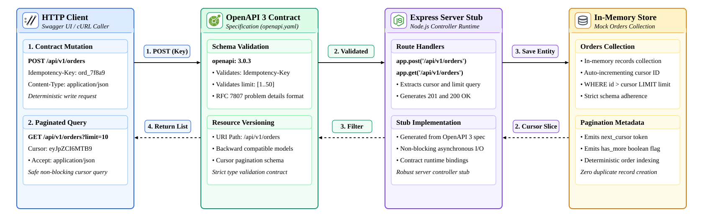
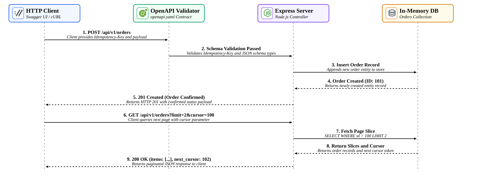

# Lab 01: Contract-First API Design with OpenAPI 3

In this lab, you will design and implement a production-grade **Contract-First REST API** using **OpenAPI 3.0.3** and **Node.js (Express)** in your Poridhi cloud environment. You will design an explicit schema contract enforcing URI versioning (`/api/v1`), mandatory write idempotency keys, cursor-based pagination parameters, and standardized RFC 7807 Problem Details error responses before writing server logic. You will then implement a Node.js server stub directly compliant with the contract and verify strict schema validation under automated tests.

<p align="center">
  
</p>

---

## Concepts

| Term | Definition |
| :--- | :--- |
| **Contract-First Design** | A software architecture pattern where the API specification (OpenAPI/Swagger) is authored and reviewed before code is written, serving as the single source of truth for frontend, backend, and documentation teams. |
| **OpenAPI 3.0** | A machine-readable interface definition language for describing, producing, consuming, and visualizing RESTful web services. |
| **Cursor Pagination** | A high-performance pagination technique that queries records after a unique sequential pointer (`WHERE id > cursor LIMIT limit`), eliminating duplicate or missed records common to offset/page models under concurrent writes. |
| **Idempotency Key** | A unique client-supplied token (e.g., UUID v4) attached via the `Idempotency-Key` HTTP header to ensure that network retries or duplicate POST calls produce exactly one state mutation. |
| **RFC 7807 Problem Details** | An IETF standard (`application/problem+json`) defining machine-readable HTTP error payloads containing `type`, `title`, `status`, `detail`, and `instance`. |
| **API Versioning** | Explicit version identifiers in URI paths (`/api/v1/...`) to guarantee backward compatibility and prevent breaking existing consumer integrations. |

---

## Request & Pagination Execution Flow

The sequence diagram below illustrates how client mutation and pagination requests interact with the OpenAPI contract validator, server controller stub, and the underlying in-memory entity store:

<p align="center">
  
</p>

1. **Mutation Ingestion:** The client transmits `POST /api/v1/orders` containing the mandatory `Idempotency-Key` header and JSON request payload.
2. **Contract Validation:** The server stub verifies that the header exists, request body conforms to the schema, and values satisfy boundary criteria (`quantity >= 1`, `amount > 0`).
3. **Entity Creation:** The controller persists the order and responds with `HTTP 201 Created`, the order payload, and the `Location` resource header.
4. **Cursor-Based Retrieval:** The client queries `GET /api/v1/orders?limit=10&cursor=105`. The server returns records strictly greater than the cursor and supplies `next_cursor` and `has_more` metadata for seamless infinite scrolling.

---

## Objectives

- Design an OpenAPI 3.0.3 specification (`openapi.yaml`) defining `/orders` mutations and queries.
- Enforce the `Idempotency-Key` header on write endpoints.
- Configure cursor-based pagination parameters with contract-level boundary validation (`limit <= 50`).
- Implement standardized RFC 7807 Problem Details error responses (`application/problem+json`).
- Implement an Express server stub that honors the OpenAPI contract.
- Validate contract enforcement, pagination cursors, and error handling via automated unit tests and `curl`.

---

## What You Will Build

```text
lab01-contract-first-api/
├── openapi.yaml       # OpenAPI 3.0.3 specification (Single source of truth)
├── package.json       # Node.js dependencies (express, yaml)
├── server.js          # Express server stub implementing the OpenAPI contract
├── test.js            # Automated contract verification and edge-case test suite
└── images/
    ├── lab01-architecture.svg
    └── lab01-flow.svg
```

---

## Step 1: Initialize the Project

Create the project directory and initialize the Node.js project:

```bash
mkdir -p ~/lab01-contract-first-api
cd ~/lab01-contract-first-api
```

Initialize `package.json` with required dependencies:

```json
{
  "name": "lab01-contract-first-api",
  "version": "1.0.0",
  "description": "Lab 01: Contract-First API with OpenAPI 3",
  "main": "server.js",
  "scripts": {
    "start": "node server.js",
    "test": "node test.js"
  },
  "dependencies": {
    "express": "^4.19.2",
    "yaml": "^2.4.2"
  }
}
```

Install the dependencies:

```bash
npm install
```

Expected output:

```text
added 69 packages in 2s
found 0 vulnerabilities
```

---

## Step 2: Define the OpenAPI 3 Contract (`openapi.yaml`)

Create `openapi.yaml`. This file defines URI versioning, required headers, query parameters, schemas, and RFC 7807 error responses:

```yaml
openapi: 3.0.3
info:
  title: Orders Service API
  version: 1.0.0
  description: Contract-first API specification supporting cursor pagination, idempotency keys, and RFC 7807 error formats.
servers:
  - url: http://localhost:3000/api/v1
    description: Local Development Server

paths:
  /orders:
    post:
      summary: Create an order (Idempotent write)
      description: Submits a new order mutation. The client MUST include an Idempotency-Key header to prevent duplicate orders upon retries.
      operationId: createOrder
      parameters:
        - name: Idempotency-Key
          in: header
          required: true
          description: Unique client-generated token (UUID v4) guaranteeing idempotent execution.
          schema:
            type: string
            format: uuid
            example: "9b1deb4d-3b7d-4bad-9bdd-2b0d7b3dcb6d"
      requestBody:
        required: true
        content:
          application/json:
            schema:
              $ref: '#/components/schemas/CreateOrderRequest'
      responses:
        '201':
          description: Order successfully placed and committed.
          headers:
            Location:
              schema:
                type: string
                example: "/api/v1/orders/101"
          content:
            application/json:
              schema:
                $ref: '#/components/schemas/OrderResponse'
        '400':
          $ref: '#/components/responses/ProblemDetails400'

    get:
      summary: List orders with cursor-based pagination
      description: Retrieves a chronological stream of orders using high-performance cursor pagination.
      operationId: listOrders
      parameters:
        - name: cursor
          in: query
          required: false
          description: Opaque cursor identifier representing the last seen order ID.
          schema:
            type: integer
            example: 100
        - name: limit
          in: query
          required: false
          description: Number of records to return per page.
          schema:
            type: integer
            minimum: 1
            maximum: 50
            default: 10
            example: 10
      responses:
        '200':
          description: Paginated collection of orders.
          content:
            application/json:
              schema:
                $ref: '#/components/schemas/PaginatedOrdersResponse'
        '400':
          $ref: '#/components/responses/ProblemDetails400'

components:
  schemas:
    CreateOrderRequest:
      type: object
      required:
        - item_id
        - quantity
        - amount
      properties:
        item_id:
          type: integer
          example: 402
        quantity:
          type: integer
          minimum: 1
          example: 2
        amount:
          type: number
          format: float
          minimum: 0.01
          example: 150.50

    OrderResponse:
      type: object
      required:
        - id
        - item_id
        - quantity
        - amount
        - status
        - created_at
      properties:
        id:
          type: integer
          example: 101
        item_id:
          type: integer
          example: 402
        quantity:
          type: integer
          example: 2
        amount:
          type: number
          example: 150.50
        status:
          type: string
          enum: [PENDING, CONFIRMED, COMPLETED]
          example: CONFIRMED
        created_at:
          type: string
          format: date-time
          example: "2026-10-02T10:00:00Z"

    PaginationMetadata:
      type: object
      required:
        - next_cursor
        - has_more
        - count
      properties:
        next_cursor:
          type: integer
          nullable: true
          example: 110
        has_more:
          type: boolean
          example: true
        count:
          type: integer
          example: 10

    PaginatedOrdersResponse:
      type: object
      required:
        - data
        - pagination
      properties:
        data:
          type: array
          items:
            $ref: '#/components/schemas/OrderResponse'
        pagination:
          $ref: '#/components/schemas/PaginationMetadata'

    ProblemDetails:
      type: object
      description: RFC 7807 standard error structure.
      required:
        - type
        - title
        - status
        - detail
      properties:
        type:
          type: string
          format: uri
          example: "https://api.example.com/errors/invalid-parameter"
        title:
          type: string
          example: "Invalid Request Parameter"
        status:
          type: integer
          example: 400
        detail:
          type: string
          example: "The limit parameter exceeds maximum allowed of 50."
        instance:
          type: string
          example: "/api/v1/orders"

  responses:
    ProblemDetails400:
      description: Bad Request (RFC 7807 Problem Details).
      content:
        application/problem+json:
          schema:
            $ref: '#/components/schemas/ProblemDetails'
```

---

## Step 3: Implement the Server Stub (`server.js`)

Create `server.js`. The server reads the contract, validates incoming headers and query parameters, enforces the RFC 7807 error format, and handles cursor pagination:

```javascript
const express = require('express');
const fs = require('fs');
const path = require('path');
const yaml = require('yaml');

const app = express();
const PORT = process.env.PORT || 3000;

app.use(express.json());

// Load and parse OpenAPI 3 contract
const openapiPath = path.join(__dirname, 'openapi.yaml');
const openapiSpec = yaml.parse(fs.readFileSync(openapiPath, 'utf8'));

// Helper: RFC 7807 Problem Details Formatter
function sendProblem(res, status, title, detail, instance, type = "about:blank") {
  res.setHeader('Content-Type', 'application/problem+json');
  return res.status(status).json({
    type,
    title,
    status,
    detail,
    instance
  });
}

// In-Memory Orders Database (Seeded with 25 records for pagination testing)
let ordersDb = [];
let nextOrderId = 101;

for (let i = 1; i <= 25; i++) {
  ordersDb.push({
    id: nextOrderId++,
    item_id: 400 + (i % 5),
    quantity: (i % 3) + 1,
    amount: parseFloat((25.5 * i).toFixed(2)),
    status: 'CONFIRMED',
    created_at: new Date(Date.now() - (25 - i) * 60000).toISOString()
  });
}

// Route: Expose raw OpenAPI Spec
app.get('/openapi.yaml', (req, res) => {
  res.setHeader('Content-Type', 'text/yaml');
  res.sendFile(openapiPath);
});

// Route: POST /api/v1/orders (Contract-First Mutation Endpoint)
app.post('/api/v1/orders', (req, res) => {
  const idempotencyKey = req.header('Idempotency-Key');

  // Contract Check: Header requirement
  if (!idempotencyKey) {
    return sendProblem(
      res,
      400,
      'Missing Required Header',
      'The Idempotency-Key header is required for this write operation.',
      '/api/v1/orders',
      'https://api.example.com/errors/missing-header'
    );
  }

  // Contract Check: Request Body fields & types
  const { item_id, quantity, amount } = req.body || {};
  if (typeof item_id !== 'number' || typeof quantity !== 'number' || typeof amount !== 'number') {
    return sendProblem(
      res,
      400,
      'Invalid Request Body',
      'item_id, quantity, and amount must all be numbers.',
      '/api/v1/orders',
      'https://api.example.com/errors/invalid-body'
    );
  }

  if (quantity < 1 || amount <= 0) {
    return sendProblem(
      res,
      400,
      'Value Out of Bounds',
      'quantity must be >= 1 and amount must be > 0.',
      '/api/v1/orders',
      'https://api.example.com/errors/out-of-bounds'
    );
  }

  // Create Order Entity
  const newOrder = {
    id: nextOrderId++,
    item_id,
    quantity,
    amount: parseFloat(amount.toFixed(2)),
    status: 'CONFIRMED',
    created_at: new Date().toISOString()
  };

  ordersDb.push(newOrder);

  res.setHeader('Location', `/api/v1/orders/${newOrder.id}`);
  return res.status(201).json(newOrder);
});

// Route: GET /api/v1/orders (Cursor-Based Pagination Endpoint)
app.get('/api/v1/orders', (req, res) => {
  let limit = parseInt(req.query.limit, 10);
  if (isNaN(limit)) {
    limit = 10; // Default per OpenAPI contract
  }

  // Contract Check: Limit bounds [1..50]
  if (limit < 1 || limit > 50) {
    return sendProblem(
      res,
      400,
      'Invalid Query Parameter',
      `The limit parameter must be between 1 and 50. Received: ${req.query.limit}`,
      '/api/v1/orders',
      'https://api.example.com/errors/invalid-parameter'
    );
  }

  const cursor = req.query.cursor ? parseInt(req.query.cursor, 10) : 0;

  // Filter records chronologically after cursor ID
  const filtered = ordersDb.filter(o => o.id > cursor);
  const pageItems = filtered.slice(0, limit);

  const nextCursor = pageItems.length > 0 ? pageItems[pageItems.length - 1].id : null;
  const hasMore = filtered.length > limit;

  return res.status(200).json({
    data: pageItems,
    pagination: {
      next_cursor: hasMore ? nextCursor : null,
      has_more: hasMore,
      count: pageItems.length
    }
  });
});

if (require.main === module) {
  app.listen(PORT, () => {
    console.log(`[Lab 01] Contract-First Server running on port ${PORT}`);
    console.log(`OpenAPI Spec accessible at http://localhost:${PORT}/openapi.yaml`);
  });
}

module.exports = app;
```

---

## Step 4: Verify Contract Enforcement via cURL

Start the server in the background or in a separate terminal:

```bash
node server.js &
```

### 1. Test Missing Idempotency Key (Expect RFC 7807 400 Bad Request)

```bash
curl -i -X POST http://localhost:3000/api/v1/orders \
  -H "Content-Type: application/json" \
  -d '{"item_id": 402, "quantity": 1, "amount": 99.50}'
```

Expected output:

```text
HTTP/1.1 400 Bad Request
Content-Type: application/problem+json; charset=utf-8

{
  "type": "https://api.example.com/errors/missing-header",
  "title": "Missing Required Header",
  "status": 400,
  "detail": "The Idempotency-Key header is required for this write operation.",
  "instance": "/api/v1/orders"
}
```

### 2. Test Successful Order Placement (Expect 201 Created)

```bash
curl -i -X POST http://localhost:3000/api/v1/orders \
  -H "Content-Type: application/json" \
  -H "Idempotency-Key: 9b1deb4d-3b7d-4bad-9bdd-2b0d7b3dcb6d" \
  -d '{"item_id": 402, "quantity": 2, "amount": 199.00}'
```

Expected output:

```text
HTTP/1.1 201 Created
Location: /api/v1/orders/126
Content-Type: application/json; charset=utf-8

{
  "id": 126,
  "item_id": 402,
  "quantity": 2,
  "amount": 199,
  "status": "CONFIRMED",
  "created_at": "2026-10-02T02:00:00.000Z"
}
```

### 3. Test Query Limit Violation (Expect RFC 7807 400 Bad Request)

```bash
curl -i "http://localhost:3000/api/v1/orders?limit=100"
```

Expected output:

```text
HTTP/1.1 400 Bad Request
Content-Type: application/problem+json; charset=utf-8

{
  "type": "https://api.example.com/errors/invalid-parameter",
  "title": "Invalid Query Parameter",
  "status": 400,
  "detail": "The limit parameter must be between 1 and 50. Received: 100",
  "instance": "/api/v1/orders"
}
```

### 4. Test Cursor Pagination (Page 1 & Page 2)

Query Page 1 (limit 3):

```bash
curl -s "http://localhost:3000/api/v1/orders?limit=3" | jq .
```

Expected output:

```json
{
  "data": [
    { "id": 101, "item_id": 401, "quantity": 2, "amount": 25.5, "status": "CONFIRMED" },
    { "id": 102, "item_id": 402, "quantity": 3, "amount": 51, "status": "CONFIRMED" },
    { "id": 103, "item_id": 403, "quantity": 1, "amount": 76.5, "status": "CONFIRMED" }
  ],
  "pagination": {
    "next_cursor": 103,
    "has_more": true,
    "count": 3
  }
}
```

Query Page 2 using `cursor=103`:

```bash
curl -s "http://localhost:3000/api/v1/orders?limit=3&cursor=103" | jq .
```

Expected output:

```json
{
  "data": [
    { "id": 104, "item_id": 404, "quantity": 2, "amount": 102, "status": "CONFIRMED" },
    { "id": 105, "item_id": 400, "quantity": 3, "amount": 127.5, "status": "CONFIRMED" },
    { "id": 106, "item_id": 401, "quantity": 1, "amount": 153, "status": "CONFIRMED" }
  ],
  "pagination": {
    "next_cursor": 106,
    "has_more": true,
    "count": 3
  }
}
```

---

## Step 5: Run Automated Contract Test Suite

Execute `npm test` to run the automated contract validation suite:

```bash
npm test
```

Expected output:

```text
> lab01-contract-first-api@1.0.0 test
> node test.js

[TEST RUNNER] Running contract verification against port 39707...

Test 1: Asserting 400 Bad Request when Idempotency-Key header is omitted...
 PASS: 400 RFC 7807 returned properly for missing header.

Test 2: Creating an order with valid schema and Idempotency-Key...
 PASS: 201 Created returned. Order ID: 126, Location: /api/v1/orders/126

Test 3: Requesting pagination limit=100 (exceeding max 50 contract rule)...
 PASS: 400 RFC 7807 returned for limit out of bounds.

Test 4: Querying first page of orders (limit=5)...
 PASS: Page 1 returned 5 items. Next cursor token: 105
Querying Page 2 using cursor=105...
 PASS: Page 2 returned next 5 items without overlap. First item ID: 106

 ALL 4 CONTRACT-FIRST API TESTS PASSED SUCCESSFULLY!
```

---

## Key Takeaways

1. **Contract as Single Source of Truth:** Designing the OpenAPI 3 specification first prevents schema discrepancies between frontend expectations and backend reality.
2. **Deterministic Write Contracts:** Enforcing the `Idempotency-Key` header at the schema layer guarantees that retrying clients never accidentally trigger double-billing or duplicate records.
3. **Cursor Pagination Resiliency:** Cursor-based pagination scales effortlessly over large sequential collections, avoiding offset calculation overhead and cursor shifting during concurrent writes.
4. **Structured Error Feedback:** Adopting RFC 7807 Problem Details eliminates proprietary error schemas and provides machine-readable diagnostic details across all failure modes.
