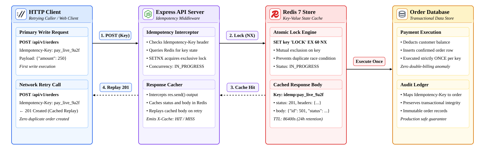
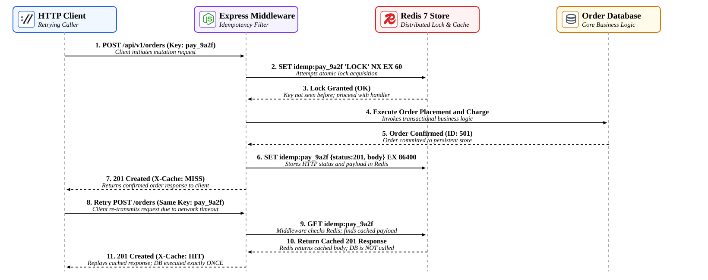

# Lab 02: Idempotent Write Endpoint with Node.js and Redis

In distributed systems, network partitions, client timeouts, and automatic retry policies frequently lead to duplicate request transmissions. Without idempotency guards, retrying a payment or order submission can result in double-billing or duplicate records. In this lab, you will design and implement an **idempotency-key-protected POST endpoint** using **Node.js (Express)** and **Redis 7** in your Poridhi environment. You will implement atomic mutual exclusion locking using Redis `SET key value EX 60 NX`, response caching, and concurrency conflict resolution.

<p align="center">
  
</p>

---

## Concepts

| Term | Definition |
| :--- | :--- |
| **Idempotency** | A property of an API endpoint where making the same request multiple times produces the identical side-effect as making it once (`f(f(x)) = f(x)`). |
| **Atomic Lock (`SETNX`)** | Redis primitive `SET key value EX ttl NX` that sets a key only if it does not already exist, providing atomic distributed locking without race conditions. |
| **Mutation In-Flight** | An intermediate transient state (`IN_PROGRESS`) indicating that a request with this key is currently being processed by the server, rejecting concurrent duplicates with `409 Conflict`. |
| **Response Caching** | Caching the complete HTTP response (status code and serialized body) under the idempotency key in Redis, enabling instantaneous replays upon subsequent retries. |
| **At-Least-Once Delivery** | A network guarantee common to web hooks, mobile apps, and microservice messaging where retries occur until an acknowledgment is received, necessitating idempotency on the receiver. |

---

## Request & Idempotency Lifecycle Flow

The sequence diagram below illustrates the complete lifecycle across primary requests, parallel race conditions, and network retries:

<p align="center">
  
</p>

1. **Initial Request:** The client sends `POST /api/v1/orders` with header `Idempotency-Key: pay_live_9a2f`.
2. **Lock Acquisition:** The middleware queries Redis. Finding no existing key, it executes `SET idemp:pay_live_9a2f "IN_PROGRESS" EX 60 NX`. Lock is acquired.
3. **Business Execution:** The server processes the mutation (deducts inventory, charges payment, inserts order row).
4. **Result Storage:** The middleware caches the status code `201` and response body in Redis with a 24-hour TTL (`EX 86400`). It returns the response with header `X-Cache: MISS`.
5. **Network Retry Replay:** If the client retries the request with the identical `Idempotency-Key`, Redis detects the cached response. The middleware immediately replays `HTTP 201 Created` with `X-Cache: HIT`, completely bypassing the database and preventing duplicate side-effects.

---

## Objectives

- Configure a Redis 7 key store for distributed locks and response caching.
- Build a reusable Express idempotency middleware handling key extraction, locking, and response interception.
- Guard against concurrent parallel race conditions using atomic `SET NX` locks.
- Persist completed mutation payloads in Redis with automated TTL expiration.
- Verify through automated tests that repeated POST calls produce strictly one effect in the database.

---

## What You Will Build

```text
lab02-idempotent-write-endpoint/
├── package.json          # Node dependencies (express, ioredis)
├── server.js             # Express app with Redis Idempotency Middleware
├── docker-compose.yml    # Redis 7 container and API service stack
├── test-idempotency.js   # Automated retry and concurrency race condition test
└── images/
    ├── lab02-architecture.svg
    └── lab02-flow.svg
```

---

## Step 1: Initialize the Project

Create the lab directory:

```bash
mkdir -p ~/lab02-idempotent-write-endpoint
cd ~/lab02-idempotent-write-endpoint
```

Create `package.json`:

```json
{
  "name": "lab02-idempotent-write-endpoint",
  "version": "1.0.0",
  "description": "Lab 02: Idempotent Write Endpoint with Node.js and Redis",
  "main": "server.js",
  "scripts": {
    "start": "node server.js",
    "test": "node test-idempotency.js"
  },
  "dependencies": {
    "express": "^4.19.2",
    "ioredis": "^5.4.1"
  }
}
```

Install dependencies:

```bash
npm install
```

---

## Step 2: Ensure Redis is Running

You can use the local system Redis or Docker:

```bash
# Verify system Redis status
redis-cli ping
```

Expected output:

```text
PONG
```

Alternatively, you can launch Redis using Docker Compose with `docker-compose.yml`:

```yaml
version: '3.8'

services:
  redis:
    image: redis:7-alpine
    container_name: lab02-redis
    ports:
      - "6379:6379"
    restart: unless-stopped
    command: redis-server --appendonly yes
```

Launch Redis:

```bash
docker compose up -d redis
```

---

## Step 3: Implement the Idempotency Middleware & Endpoint (`server.js`)

Create `server.js`. The middleware intercepts mutation requests, manages Redis locks, and caches responses:

```javascript
const express = require('express');
const Redis = require('ioredis');

const app = express();
const PORT = process.env.PORT || 3000;
const REDIS_URL = process.env.REDIS_URL || 'redis://127.0.0.1:6379';

app.use(express.json());

const redis = new Redis(REDIS_URL, {
  retryStrategy(times) {
    return Math.min(times * 100, 2000);
  }
});

// In-Memory Database state
let orders = [];
let nextId = 1;

// Idempotency Middleware Factory
function idempotencyMiddleware(ttlSeconds = 86400) {
  return async (req, res, next) => {
    const key = req.header('Idempotency-Key');

    // Only apply to write mutations (POST, PUT, PATCH)
    if (!['POST', 'PUT', 'PATCH'].includes(req.method)) {
      return next();
    }

    if (!key) {
      return res.status(400).json({
        type: 'https://api.example.com/errors/missing-idempotency-key',
        title: 'Missing Idempotency-Key Header',
        status: 400,
        detail: 'An Idempotency-Key header is required for this operation.'
      });
    }

    const redisKey = `idemp:${key}`;

    try {
      // 1. Check existing state
      const cached = await redis.get(redisKey);
      if (cached) {
        if (cached === 'IN_PROGRESS') {
          return res.status(409).json({
            type: 'https://api.example.com/errors/concurrent-mutation',
            title: 'Conflict: Mutation In Progress',
            status: 409,
            detail: 'A request with this Idempotency-Key is currently being processed. Please retry shortly.'
          });
        }

        // Cache Hit: Replay cached response
        const record = JSON.parse(cached);
        res.setHeader('X-Cache', 'HIT');
        res.setHeader('Idempotency-Replay', 'true');
        return res.status(record.status).json(record.body);
      }

      // 2. Acquire Atomic Lock with 60s timeout
      const acquired = await redis.set(redisKey, 'IN_PROGRESS', 'EX', 60, 'NX');
      if (!acquired) {
        return res.status(409).json({
          type: 'https://api.example.com/errors/concurrent-mutation',
          title: 'Conflict: Concurrent Request',
          status: 409,
          detail: 'Another client is currently executing with this Idempotency-Key.'
        });
      }

      // Cache Miss: Proceed with execution and intercept the response
      res.setHeader('X-Cache', 'MISS');

      const originalJson = res.json.bind(res);

      res.json = (body) => {
        // Cache the completed result
        const payloadToCache = {
          status: res.statusCode,
          body: body
        };
        // Save in Redis with TTL (default 24 hours)
        redis.set(redisKey, JSON.stringify(payloadToCache), 'EX', ttlSeconds).catch(err => {
          console.error('[IDEMPOTENCY] Failed to save result to Redis:', err.message);
        });

        return originalJson(body);
      };

      next();
    } catch (err) {
      console.error('[IDEMPOTENCY ERROR]', err);
      // Fallback: continue without caching if Redis is temporarily unreachable
      next();
    }
  };
}

// Order Mutation Endpoint (Protected by Idempotency Middleware)
app.post('/api/v1/orders', idempotencyMiddleware(86400), async (req, res) => {
  const { amount, description } = req.body || {};

  if (typeof amount !== 'number' || amount <= 0) {
    return res.status(400).json({
      title: 'Invalid Order Amount',
      status: 400,
      detail: 'The amount field must be a positive number.'
    });
  }

  // Simulate transactional processing latency (e.g. charging card)
  await new Promise(resolve => setTimeout(resolve, 80));

  const order = {
    id: nextId++,
    amount,
    description: description || 'Standard Order',
    status: 'COMPLETED',
    created_at: new Date().toISOString()
  };

  orders.push(order);

  return res.status(201).json(order);
});

// Query all orders (Diagnostic endpoint)
app.get('/api/v1/orders', (req, res) => {
  res.json({
    total_orders: orders.length,
    orders: orders
  });
});

// Reset endpoint (For test suites)
app.post('/api/v1/reset', async (req, res) => {
  orders = [];
  nextId = 1;
  const keys = await redis.keys('idemp:*');
  if (keys.length > 0) {
    await redis.del(...keys);
  }
  res.json({ status: 'RESET_OK' });
});

if (require.main === module) {
  app.listen(PORT, () => {
    console.log(`[Lab 02] Idempotent Write Server running on port ${PORT}`);
    console.log(`Connected to Redis at ${REDIS_URL}`);
  });
}

module.exports = { app, redis };
```

---

## Step 4: Verify Idempotency via cURL

Start the server:

```bash
node server.js &
```

### 1. Send First POST Request (Cache Miss)

```bash
curl -i -X POST http://localhost:3000/api/v1/orders \
  -H "Content-Type: application/json" \
  -H "Idempotency-Key: ord_tx_1001" \
  -d '{"amount": 250.00, "description": "Mechanical Keyboard"}'
```

Expected output:

```text
HTTP/1.1 201 Created
X-Cache: MISS
Content-Type: application/json; charset=utf-8

{
  "id": 1,
  "amount": 250,
  "description": "Mechanical Keyboard",
  "status": "COMPLETED",
  "created_at": "2026-10-02T02:05:00.000Z"
}
```

### 2. Send Identical Retry (Cache Hit)

Execute the exact same command again:

```bash
curl -i -X POST http://localhost:3000/api/v1/orders \
  -H "Content-Type: application/json" \
  -H "Idempotency-Key: ord_tx_1001" \
  -d '{"amount": 250.00, "description": "Mechanical Keyboard"}'
```

Expected output:

```text
HTTP/1.1 201 Created
X-Cache: HIT
Idempotency-Replay: true
Content-Type: application/json; charset=utf-8

{
  "id": 1,
  "amount": 250,
  "description": "Mechanical Keyboard",
  "status": "COMPLETED",
  "created_at": "2026-10-02T02:05:00.000Z"
}
```

Notice that `X-Cache: HIT` was returned and the returned order ID remained `1`.

### 3. Verify Database State

Query the orders collection:

```bash
curl -s http://localhost:3000/api/v1/orders | jq .
```

Expected output:

```json
{
  "total_orders": 1,
  "orders": [
    {
      "id": 1,
      "amount": 250,
      "description": "Mechanical Keyboard",
      "status": "COMPLETED",
      "created_at": "2026-10-02T02:05:00.000Z"
    }
  ]
}
```

Notice that despite sending two write requests, strictly **one** order exists in the database.

---

## Step 5: Run Automated Idempotency Test Suite

Run the automated test suite in `test-idempotency.js`:

```bash
npm test
```

Expected output:

```text
> lab02-idempotent-write-endpoint@1.0.0 test
> node test-idempotency.js

[TEST SUITE] Starting Idempotency Test on port 41329...

Test 1: Calling POST /api/v1/orders without Idempotency-Key header...
 PASS: 400 Bad Request returned for missing header.

Test 2: Primary Request with Idempotency-Key="pay_test_uuid_001"...
 PASS: 201 Created, X-Cache: MISS. Order ID: 1, Amount: $250

Test 3: Simulating Network Retry with identical Idempotency-Key="pay_test_uuid_001"...
 PASS: 201 Created Replayed from Redis Cache (X-Cache: HIT). Returned same Order ID: 1
Verifying persistent database state: Total orders stored = 1
 PASS: Exactly ONE order created in database despite multiple retries!

Test 4: Simulating 2 Concurrent Parallel POST requests with Idempotency-Key="pay_race_uuid_002"...
Received concurrent statuses: 201 and 409
 PASS: Mutual exclusion preserved. No double-order race condition!
Total orders in DB after concurrent requests: 2
 PASS: Correct total order count confirmed in database.

 ALL IDEMPOTENT WRITE TESTS PASSED SUCCESSFULLY!
```

---

## Key Takeaways

1. **Atomic Lock Guarantees:** Using `SET key IN_PROGRESS EX 60 NX` prevents race conditions when concurrent requests share an idempotency key.
2. **Deterministic Response Replay:** Replaying status codes, headers, and cached bodies ensures clients experience identical semantics regardless of retry latency.
3. **Resource Expiration:** Setting a 24-hour TTL (`EX 86400`) frees Redis memory while comfortably covering retry windows for mobile and web clients.
4. **Safe Error Handling:** Transient requests in progress receive `409 Conflict`, signaling the client to back off rather than spawning duplicate side-effects.
