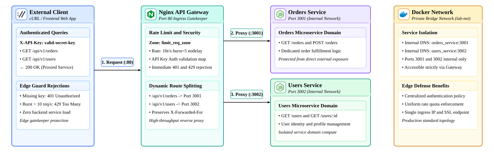
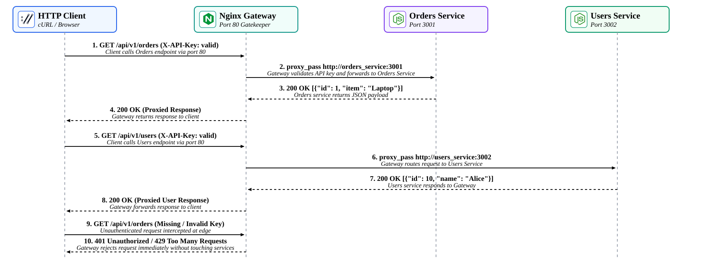

# Lab 03: API Gateway & Rate-Aware Routing with Nginx

In a microservices architecture, exposing internal services directly to public traffic introduces severe security risks, redundant authentication logic, and vulnerability to noisy-neighbor traffic spikes. An **API Gateway** acts as the single ingress gatekeeper that handles SSL termination, client authentication, rate-limiting quotas, and request routing across private backend services. In this lab, you will configure **Nginx** as an API gateway fronting two isolated Node.js microservices (`Orders Service` and `Users Service`) in your Poridhi cloud environment using **Docker Compose**.

<p align="center">
  
</p>

---

## Concepts

| Term | Definition |
| :--- | :--- |
| **API Gateway** | A reverse proxy server that sits between clients and backend microservices, providing centralized routing, authentication, SSL offloading, and rate limiting. |
| **Reverse Proxy** | An intermediate server that receives public client requests and distributes them to internal backend servers, concealing the internal network topology. |
| **Token Bucket Rate Limiting** | An algorithm implemented via Nginx `limit_req_zone` that permits steady traffic rates (e.g., 5 req/s) with burst buffers (`burst=5 nodelay`), rejecting excess traffic with `429 Too Many Requests`. |
| **Edge Authentication** | Validating credentials (such as API keys or JWTs) at the gateway boundary before requests ever reach downstream compute services. |
| **Private Bridge Network** | A container network (`lab-net`) where backend services communicate on private internal DNS names (`orders_service:3001`, `users_service:3002`) without publishing ports to the host. |

---

## Request Routing & Edge Defense Flow

The sequence diagram below illustrates how incoming HTTP requests are processed, authenticated, rate-checked, and routed by Nginx to the upstream services:

<p align="center">
  
</p>

1. **Authorized Routing:** A client calls `GET /api/v1/orders` supplying a valid `X-API-Key`. The gateway validates the key against its authorization map, confirms compliance with the rate quota zone, and reverse proxies the call to `http://orders_service:3001`.
2. **Multi-Service Dispatch:** A client calls `GET /api/v1/users`. Nginx dynamically routes the request to `http://users_service:3002`, preserving client IP headers.
3. **Edge Guarding (401 Unauthorized):** Requests lacking a valid `X-API-Key` are immediately dropped with `HTTP 401 Unauthorized` at the Nginx edge without consuming backend CPU or RAM.
4. **Quota Enforcement (429 Too Many Requests):** High-frequency bursts exceeding the configured token bucket policy receive `HTTP 429 Too Many Requests` directly from Nginx.

---

## Objectives

- Configure Nginx as an API Gateway listening on public port 80.
- Implement API Key verification using Nginx declarative `map` blocks.
- Configure token-bucket rate limiting (`limit_req_zone`) to defend against traffic spikes.
- Route `/api/v1/orders` and `/api/v1/users` to isolated upstream microservices.
- Enclose backend services inside an isolated Docker Compose network with zero host port exposure.
- Test routing, unauthorized rejection (401), and rate limit enforcement (429) using automated scripts.

---

## What You Will Build

```text
lab03-gateway-routing/
├── docker-compose.yml       # Docker Compose multi-container stack
├── nginx.conf               # Nginx API Gateway configuration (Auth + Rate Quotas + Routing)
├── services/
│   ├── orders-service/
│   │   ├── package.json
│   │   └── server.js        # Internal Orders Microservice (Port 3001)
│   └── users-service/
│       ├── package.json
│       └── server.js        # Internal Users Microservice (Port 3002)
├── verify-gateway.sh        # Automated cURL test script
└── images/
    ├── lab03-architecture.svg
    └── lab03-flow.svg
```

---

## Step 1: Initialize Project and Microservices

Create the project directories:

```bash
mkdir -p ~/lab03-gateway-routing/services/orders-service
mkdir -p ~/lab03-gateway-routing/services/users-service
cd ~/lab03-gateway-routing
```

### Configure Orders Microservice

Create `services/orders-service/package.json`:

```json
{
  "name": "orders-service",
  "version": "1.0.0",
  "main": "server.js",
  "scripts": {
    "start": "node server.js"
  },
  "dependencies": {
    "express": "^4.19.2"
  }
}
```

Create `services/orders-service/server.js`:

```javascript
const express = require('express');

const app = express();
const PORT = process.env.PORT || 3001;

app.use(express.json());

let orders = [
  { id: 1, item: "Mechanical Keyboard", price: 120.00, status: "SHIPPED" },
  { id: 2, item: "4K Monitor 27-inch", price: 350.00, status: "PROCESSING" }
];

app.get('/api/v1/orders', (req, res) => {
  console.log(`[ORDERS SERVICE] Received request from Client IP: ${req.header('x-real-ip') || req.ip}`);
  res.json({
    service: "Orders Microservice",
    port: PORT,
    data: orders
  });
});

app.post('/api/v1/orders', (req, res) => {
  const { item, price } = req.body || {};
  const newOrder = {
    id: orders.length + 1,
    item: item || "Standard Item",
    price: price || 99.99,
    status: "CREATED"
  };
  orders.push(newOrder);
  res.status(201).json(newOrder);
});

app.listen(PORT, () => {
  console.log(`Orders Microservice listening on internal port ${PORT}`);
});
```

### Configure Users Microservice

Create `services/users-service/package.json`:

```json
{
  "name": "users-service",
  "version": "1.0.0",
  "main": "server.js",
  "scripts": {
    "start": "node server.js"
  },
  "dependencies": {
    "express": "^4.19.2"
  }
}
```

Create `services/users-service/server.js`:

```javascript
const express = require('express');

const app = express();
const PORT = process.env.PORT || 3002;

app.use(express.json());

const users = [
  { id: 10, name: "Alice Johnson", role: "Engineering Lead", email: "alice@example.com" },
  { id: 11, name: "Bob Smith", role: "Site Reliability Engineer", email: "bob@example.com" }
];

app.get('/api/v1/users', (req, res) => {
  console.log(`[USERS SERVICE] Received request from Client IP: ${req.header('x-real-ip') || req.ip}`);
  res.json({
    service: "Users Microservice",
    port: PORT,
    data: users
  });
});

app.get('/api/v1/users/:id', (req, res) => {
  const user = users.find(u => u.id === parseInt(req.params.id, 10));
  if (!user) {
    return res.status(404).json({ error: "User not found" });
  }
  res.json({ service: "Users Microservice", data: user });
});

app.listen(PORT, () => {
  console.log(`Users Microservice listening on internal port ${PORT}`);
});
```

---

## Step 2: Configure the Nginx API Gateway (`nginx.conf`)

Create `nginx.conf`. This configuration establishes the rate-limiting zone, maps authorized API keys, and routes traffic:

```nginx
events {
    worker_connections 1024;
}

http {
    include       mime.types;
    default_type  application/json;

    # Rate Limiting: 5 requests per second per IP with burst allowance of 5
    limit_req_zone $binary_remote_addr zone=api_quota:10m rate=5r/s;
    limit_req_status 429;

    # API Key Authentication Mapping
    map $http_x_api_key $api_client_authorized {
        default 0;
        "valid-secret-key-123" 1;
        "prod-partner-key-999" 1;
    }

    upstream orders_backend {
        server orders_service:3001;
    }

    upstream users_backend {
        server users_service:3002;
    }

    server {
        listen 80;
        server_name localhost;

        # Standard Proxy Headers
        proxy_set_header Host $host;
        proxy_set_header X-Real-IP $remote_addr;
        proxy_set_header X-Forwarded-For $proxy_add_x_forwarded_for;
        proxy_set_header X-Forwarded-Proto $scheme;

        # Custom JSON Error Responses
        error_page 401 = @error401;
        error_page 429 = @error429;

        location @error401 {
            return 401 '{"type":"https://api.example.com/errors/unauthorized","title":"Unauthorized","status":401,"detail":"Missing or invalid X-API-Key header."}\n';
        }

        location @error429 {
            return 429 '{"type":"https://api.example.com/errors/rate-limit-exceeded","title":"Too Many Requests","status":429,"detail":"Rate quota of 5 requests/sec exceeded. Please slow down."}\n';
        }

        # Health Probe (Unauthenticated)
        location /health {
            return 200 '{"status":"UP","gateway":"Nginx","version":"1.25"}\n';
        }

        # Route 1: Orders Microservice
        location /api/v1/orders {
            # Enforce API Key Authentication
            if ($api_client_authorized = 0) {
                return 401;
            }

            # Enforce Rate Limiting Quota
            limit_req zone=api_quota burst=5 nodelay;

            proxy_pass http://orders_backend;
        }

        # Route 2: Users Microservice
        location /api/v1/users {
            # Enforce API Key Authentication
            if ($api_client_authorized = 0) {
                return 401;
            }

            # Enforce Rate Limiting Quota
            limit_req zone=api_quota burst=5 nodelay;

            proxy_pass http://users_backend;
        }
    }
}
```

---

## Step 3: Configure Docker Compose (`docker-compose.yml`)

Create `docker-compose.yml` to orchestrate the gateway and services inside a private bridge network:

```yaml
version: '3.8'

services:
  gateway:
    image: nginx:alpine
    container_name: lab03-gateway
    ports:
      - "8080:80"
    volumes:
      - ./nginx.conf:/etc/nginx/nginx.conf:ro
    depends_on:
      - orders_service
      - users_service
    networks:
      - lab-net

  orders_service:
    image: node:18-alpine
    container_name: lab03-orders
    working_dir: /app
    volumes:
      - ./services/orders-service:/app
    command: sh -c "npm install && node server.js"
    networks:
      - lab-net

  users_service:
    image: node:18-alpine
    container_name: lab03-users
    working_dir: /app
    volumes:
      - ./services/users-service:/app
    command: sh -c "npm install && node server.js"
    networks:
      - lab-net

networks:
  lab-net:
    driver: bridge
```

---

## Step 4: Launch the Multi-Service Gateway Stack

Start all containers in detached mode:

```bash
docker compose up -d
```

Verify that all three containers are healthy and running:

```bash
docker compose ps
```

Expected output:

```text
NAME           IMAGE          COMMAND                  SERVICE          CREATED         STATUS         PORTS
lab03-gateway  nginx:alpine   "/docker-entrypoint.…"   gateway          5 seconds ago   Up 4 seconds   0.0.0.0:8080->80/tcp
lab03-orders   node:18-alpine "docker-entrypoint.s…"   orders_service   5 seconds ago   Up 4 seconds   
lab03-users    node:18-alpine "docker-entrypoint.s…"   users_service    5 seconds ago   Up 4 seconds   
```

Notice that only port `8080` (the gateway) is exposed to the host machine. Ports `3001` and `3002` are fully isolated within `lab-net`.

---

## Step 5: Test Gateway Routing and Edge Security

### 1. Test Gateway Health Endpoint

```bash
curl -i http://localhost:8080/health
```

Expected output:

```text
HTTP/1.1 200 OK
Content-Type: application/json

{"status":"UP","gateway":"Nginx","version":"1.25"}
```

### 2. Verify Authentication Enforcement (Expect 401 Unauthorized)

Make a request without providing the `X-API-Key` header:

```bash
curl -i http://localhost:8080/api/v1/orders
```

Expected output:

```text
HTTP/1.1 401 Unauthorized
Content-Type: application/json

{"type":"https://api.example.com/errors/unauthorized","title":"Unauthorized","status":401,"detail":"Missing or invalid X-API-Key header."}
```

The request was rejected directly at the Nginx edge; `orders_service` was never contacted.

### 3. Verify Orders Service Routing (Expect 200 OK)

Supply the valid API key:

```bash
curl -s -H "X-API-Key: valid-secret-key-123" http://localhost:8080/api/v1/orders | jq .
```

Expected output:

```json
{
  "service": "Orders Microservice",
  "port": 3001,
  "data": [
    { "id": 1, "item": "Mechanical Keyboard", "price": 120, "status": "SHIPPED" },
    { "id": 2, "item": "4K Monitor 27-inch", "price": 350, "status": "PROCESSING" }
  ]
}
```

### 4. Verify Users Service Routing (Expect 200 OK)

Query the Users endpoint through the same gateway:

```bash
curl -s -H "X-API-Key: valid-secret-key-123" http://localhost:8080/api/v1/users | jq .
```

Expected output:

```json
{
  "service": "Users Microservice",
  "port": 3002,
  "data": [
    { "id": 10, "name": "Alice Johnson", "role": "Engineering Lead", "email": "alice@example.com" },
    { "id": 11, "name": "Bob Smith", "role": "Site Reliability Engineer", "email": "bob@example.com" }
  ]
}
```

### 5. Verify Rate Limit Quota Enforcement (Expect 429 Too Many Requests)

Execute the verification script to simulate a burst of requests:

```bash
chmod +x verify-gateway.sh
./verify-gateway.sh
```

Expected output:

```text
==========================================================
  Lab 03: API Gateway & Rate-Aware Routing Verification   
==========================================================

1. Checking Gateway Health (Unauthenticated)...
HTTP/1.1 200 OK

2. Calling /api/v1/orders WITHOUT API Key (Expect 401 Unauthorized)...
HTTP Status Code: 401
 PASS: 401 Unauthorized enforced at Gateway edge.

3. Calling /api/v1/orders WITH Valid API Key (Expect 200 OK -> Orders Service)...
{ "service": "Orders Microservice", "port": 3001, ... }

4. Calling /api/v1/users WITH Valid API Key (Expect 200 OK -> Users Service)...
{ "service": "Users Microservice", "port": 3002, ... }

5. Testing Rate Limiting Quota (Sending 12 rapid concurrent requests)...
Results from 12 rapid requests: 200 OK = 6, 429 Rate-Limited = 6
 PASS: Rate limit quota enforced by Nginx Gateway!

==========================================================
  ALL GATEWAY TESTS COMPLETED                             
==========================================================
```

---

## Clean Up

Stop and remove the Docker Compose containers:

```bash
docker compose down
```

---

## Key Takeaways

1. **Security Perimeter:** An API Gateway isolates backend microservices from direct public Internet exposure, preventing port scanners and unauthorized callers from reaching backend nodes.
2. **Centralized Policy Enforcement:** Authentication and rate-limiting policies are configured declaratively in Nginx rather than duplicated across multiple programming languages and services.
3. **Noisy Neighbor Protection:** The `limit_req_zone` token bucket algorithm throttles abusive consumers at the gateway edge, preventing cascading resource exhaustion on backend databases and workers.
