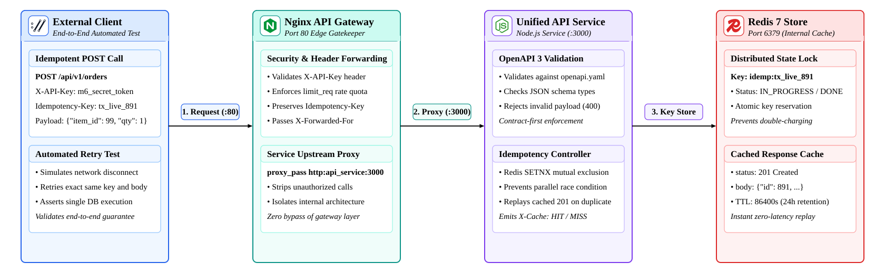
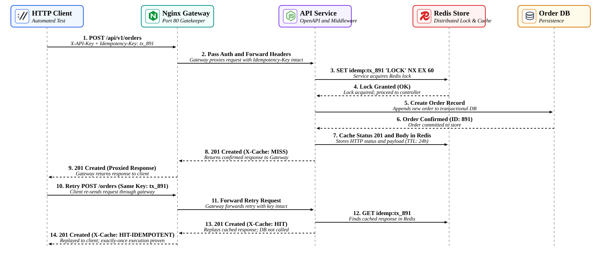

# Lab 04: Complete API Layer Integration

In this capstone integration lab, you will combine your **OpenAPI 3 Contract** (from Lab 01), **Idempotent Write Endpoint with Redis** (from Lab 02), and **API Gateway & Rate-Aware Routing with Nginx** (from Lab 03) into a complete, unified, production-grade **API Layer** in your Poridhi cloud environment. You will deploy a multi-container Docker Compose architecture where client traffic enters an Nginx gateway, undergoes edge authentication and rate limiting, forwards preserved headers (`Idempotency-Key`) to a Node.js API service, validates schemas against the OpenAPI specification, and coordinates distributed locks and cached responses in Redis.

<p align="center">
  
</p>

---

## Concepts

| Term | Definition |
| :--- | :--- |
| **Unified API Layer** | A tiered architectural pattern dividing ingress security (Nginx Gateway), contract enforcement (OpenAPI), and distributed data consistency (Redis & Service). |
| **Header Propagation** | The requirement for reverse proxies to explicitly preserve and pass custom client headers (`Idempotency-Key`, `X-Forwarded-For`) to internal backend services. |
| **Separation of Concerns** | Placing edge security, authentication, and coarse throttling at the gateway layer, while reserving domain schema validation and transactional state locking for the application layer. |
| **End-to-End Idempotency** | Guaranteeing that client retries traversing public gateways, load balancers, and internal services produce strictly one state transition in the persistent database. |
| **Layered Defense** | Rejecting malformed and unauthenticated requests at the earliest possible network boundary (401 at Gateway, 400 at Validator, 409 at Redis Lock). |

---

## End-to-End Request & Retry Flow

The sequence diagram below illustrates the 14-step request and retry lifecycle traversing the gateway, service, Redis cache, and persistent store:

<p align="center">
  
</p>

1. **Primary Request:** The client sends `POST /api/v1/orders` through the gateway (port 8080) with `X-API-Key` and `Idempotency-Key: tx_live_891`.
2. **Gateway Interception:** Nginx validates the API key, checks rate limits, and proxies the request to `api_service:3000` with the `Idempotency-Key` header intact.
3. **Contract Validation:** The Express service validates body types and parameters against `openapi.yaml`.
4. **Distributed Lock:** Idempotency middleware acquires a Redis mutex (`SET idemp:tx_live_891 "IN_PROGRESS" EX 60 NX`).
5. **Business Mutation:** Order is written to the persistent database (Order ID 1).
6. **Response Caching:** The HTTP status code `201` and payload are stored in Redis (24-hour TTL).
7. **Gateway Ingress Replay:** The gateway forwards the `201 Created` (`X-Cache: MISS`) response back to the client.
8. **Network Retry Replay:** When the client retransmits the identical request through the gateway, Nginx forwards the key, the service retrieves the cached response from Redis, and returns `HTTP 201 Created` (`X-Cache: HIT-IDEMPOTENT`) without invoking the database. Exactly one order is created!

---

## Objectives

- Combine OpenAPI 3 contracts, Redis idempotency middleware, and Nginx gateway configurations into a single Docker Compose stack.
- Configure Nginx to propagate custom headers (`Idempotency-Key`, `X-API-Key`) to internal services.
- Enforce authentication at the gateway edge and schema validation at the application layer.
- Execute an automated end-to-end integration test proving idempotency is enforced through the gateway.
- Formulate a technical reflection on gateway architectural trade-offs and authentication boundaries.

---

## What You Will Build

```text
lab04-api-layer-integration/
├── docker-compose.yml       # Complete multi-container stack (Gateway + API + Redis)
├── nginx.conf               # Gateway config with header propagation & edge auth
├── test-integration.js      # End-to-end automated integration test suite
├── verify-e2e.sh            # One-click startup, testing, and teardown script
├── api-service/
│   ├── package.json
│   ├── openapi.yaml         # Single source of truth OpenAPI 3 specification
│   ├── server.js            # Express API service with OpenAPI validation
│   └── middleware/
│       └── idempotency.js   # Reusable Redis-backed idempotency middleware
└── images/
    ├── lab04-architecture.svg
    └── lab04-flow.svg
```

---

## Step 1: Project Setup and Dependencies

Create the project directories:

```bash
mkdir -p ~/lab04-api-layer-integration/api-service/middleware
cd ~/lab04-api-layer-integration
```

Create `api-service/package.json`:

```json
{
  "name": "lab04-api-service",
  "version": "1.0.0",
  "description": "Lab 04: Unified API Service with OpenAPI Validation & Idempotency",
  "main": "server.js",
  "scripts": {
    "start": "node server.js"
  },
  "dependencies": {
    "express": "^4.19.2",
    "ioredis": "^5.4.1",
    "yaml": "^2.4.2"
  }
}
```

---

## Step 2: Define OpenAPI 3 Contract (`api-service/openapi.yaml`)

Create `api-service/openapi.yaml`:

```yaml
openapi: 3.0.3
info:
  title: Production Integrated API Layer
  version: 1.0.0
  description: End-to-end integrated API contract supporting edge gateway authentication, schema validation, and Redis idempotency.
servers:
  - url: http://localhost:8080/api/v1
    description: Nginx API Gateway Ingress

paths:
  /orders:
    post:
      summary: Place order with idempotency guarantee
      operationId: createOrder
      parameters:
        - name: Idempotency-Key
          in: header
          required: true
          description: Unique client mutation token (UUID v4) forwarded intact across the gateway.
          schema:
            type: string
            format: uuid
            example: "tx_live_891e4a3b-28f1-4db5-9e3d-71b8e4f16921"
      requestBody:
        required: true
        content:
          application/json:
            schema:
              type: object
              required:
                - item_id
                - quantity
                - amount
              properties:
                item_id:
                  type: integer
                  example: 501
                quantity:
                  type: integer
                  minimum: 1
                  example: 2
                amount:
                  type: number
                  minimum: 0.01
                  example: 299.99
      responses:
        '201':
          description: Order placed successfully (or replayed from idempotency cache).
          headers:
            X-Cache:
              schema:
                type: string
                example: "HIT-IDEMPOTENT"
          content:
            application/json:
              schema:
                type: object
                properties:
                  id:
                    type: integer
                  item_id:
                    type: integer
                  quantity:
                    type: integer
                  amount:
                    type: number
                  status:
                    type: string
                  created_at:
                    type: string
        '400':
          description: Schema validation failure (RFC 7807).
        '401':
          description: Unauthorized request dropped at gateway edge.
        '409':
          description: Concurrent mutation with identical key currently in flight.

    get:
      summary: List orders
      operationId: listOrders
      responses:
        '200':
          description: Orders list
          content:
            application/json:
              schema:
                type: object
                properties:
                  total:
                    type: integer
                  orders:
                    type: array
                    items:
                      type: object
```

---

## Step 3: Implement Redis Idempotency Middleware (`api-service/middleware/idempotency.js`)

Create `api-service/middleware/idempotency.js`:

```javascript
function createIdempotencyMiddleware(redis, ttlSeconds = 86400) {
  return async (req, res, next) => {
    const key = req.header('Idempotency-Key');

    // Only apply to write operations
    if (!['POST', 'PUT', 'PATCH'].includes(req.method)) {
      return next();
    }

    if (!key) {
      return res.status(400).json({
        type: 'https://api.example.com/errors/missing-header',
        title: 'Missing Required Header',
        status: 400,
        detail: 'The Idempotency-Key header is required for this mutation endpoint.',
        instance: req.originalUrl
      });
    }

    const redisKey = `idemp:${key}`;

    try {
      // 1. Check for existing response or lock
      const cached = await redis.get(redisKey);
      if (cached) {
        if (cached === 'IN_PROGRESS') {
          return res.status(409).json({
            type: 'https://api.example.com/errors/concurrent-mutation',
            title: 'Conflict: Mutation In Progress',
            status: 409,
            detail: 'A request with this Idempotency-Key is currently executing. Retry shortly.',
            instance: req.originalUrl
          });
        }

        // Cache Hit: Replay response
        const record = JSON.parse(cached);
        res.setHeader('X-Cache', 'HIT-IDEMPOTENT');
        res.setHeader('Idempotency-Replay', 'true');
        return res.status(record.status).json(record.body);
      }

      // 2. Acquire Atomic Lock
      const acquired = await redis.set(redisKey, 'IN_PROGRESS', 'EX', 60, 'NX');
      if (!acquired) {
        return res.status(409).json({
          type: 'https://api.example.com/errors/concurrent-mutation',
          title: 'Conflict: Concurrent Request',
          status: 409,
          detail: 'Another client is currently executing with this Idempotency-Key.',
          instance: req.originalUrl
        });
      }

      // Cache Miss: Proceed and intercept response
      res.setHeader('X-Cache', 'MISS');

      const originalJson = res.json.bind(res);

      res.json = (body) => {
        // Cache the response in Redis
        const payloadToCache = {
          status: res.statusCode,
          body: body
        };
        redis.set(redisKey, JSON.stringify(payloadToCache), 'EX', ttlSeconds).catch(() => {});
        return originalJson(body);
      };

      next();
    } catch (err) {
      console.error('[IDEMPOTENCY MIDDLEWARE ERROR]', err.message);
      next();
    }
  };
}

module.exports = { createIdempotencyMiddleware };
```

---

## Step 4: Implement the Unified API Service (`api-service/server.js`)

Create `api-service/server.js`:

```javascript
const express = require('express');
const Redis = require('ioredis');
const { createIdempotencyMiddleware } = require('./middleware/idempotency');

const app = express();
const PORT = process.env.PORT || 3000;
const REDIS_URL = process.env.REDIS_URL || 'redis://127.0.0.1:6379';

app.use(express.json());

const redis = new Redis(REDIS_URL, {
  retryStrategy(times) {
    return Math.min(times * 100, 2000);
  }
});

const idempotency = createIdempotencyMiddleware(redis, 86400);

let orders = [];
let nextId = 1;

// POST /api/v1/orders with OpenAPI Schema validation & Idempotency
app.post('/api/v1/orders', idempotency, async (req, res) => {
  const { item_id, quantity, amount } = req.body || {};

  // Schema Validation (from OpenAPI contract)
  if (typeof item_id !== 'number' || typeof quantity !== 'number' || typeof amount !== 'number') {
    return res.status(400).json({
      type: 'https://api.example.com/errors/invalid-schema',
      title: 'Invalid Request Schema',
      status: 400,
      detail: 'item_id (integer), quantity (integer), and amount (number) are required.',
      instance: req.originalUrl
    });
  }

  if (quantity < 1 || amount <= 0) {
    return res.status(400).json({
      type: 'https://api.example.com/errors/out-of-bounds',
      title: 'Value Out of Bounds',
      status: 400,
      detail: 'quantity must be >= 1 and amount must be > 0.',
      instance: req.originalUrl
    });
  }

  // Simulate transactional order execution
  await new Promise(r => setTimeout(r, 60));

  const order = {
    id: nextId++,
    item_id,
    quantity,
    amount: parseFloat(amount.toFixed(2)),
    status: 'CONFIRMED',
    created_at: new Date().toISOString()
  };

  orders.push(order);

  return res.status(201).json(order);
});

// GET /api/v1/orders
app.get('/api/v1/orders', (req, res) => {
  res.json({
    total: orders.length,
    orders: orders
  });
});

// Reset endpoint for test harness
app.post('/api/v1/reset', async (req, res) => {
  orders = [];
  nextId = 1;
  const keys = await redis.keys('idemp:*');
  if (keys.length > 0) {
    await redis.del(...keys);
  }
  res.json({ status: 'RESET_OK' });
});

if (require.main === module) {
  app.listen(PORT, () => {
    console.log(`[Lab 04 API SERVICE] Running on port ${PORT}`);
    console.log(`Connected to Redis at ${REDIS_URL}`);
  });
}

module.exports = { app, redis };
```

---

## Step 5: Configure the Gateway with Header Forwarding (`nginx.conf`)

Create `nginx.conf`. Notice the explicit `proxy_set_header Idempotency-Key $http_idempotency_key;` directive:

```nginx
events {
    worker_connections 1024;
}

http {
    include       mime.types;
    default_type  application/json;

    # Rate Limiting: 10 requests per second
    limit_req_zone $binary_remote_addr zone=api_quota:10m rate=10r/s;
    limit_req_status 429;

    # Authentication Map
    map $http_x_api_key $api_authorized {
        default 0;
        "m6_secret_token_123" 1;
        "production_admin_key" 1;
    }

    upstream api_backend {
        server api_service:3000;
    }

    server {
        listen 80;
        server_name localhost;

        # Standard Forwarding Headers
        proxy_set_header Host $host;
        proxy_set_header X-Real-IP $remote_addr;
        proxy_set_header X-Forwarded-For $proxy_add_x_forwarded_for;
        proxy_set_header X-Forwarded-Proto $scheme;

        # CRITICAL: Preserve and forward Idempotency-Key to backend microservice
        proxy_set_header Idempotency-Key $http_idempotency_key;
        proxy_set_header X-API-Key $http_x_api_key;

        # Custom JSON Error Pages
        error_page 401 = @error401;
        error_page 429 = @error429;

        location @error401 {
            return 401 '{"type":"https://api.example.com/errors/unauthorized","title":"Unauthorized","status":401,"detail":"Invalid or missing X-API-Key header at Gateway."}\n';
        }

        location @error429 {
            return 429 '{"type":"https://api.example.com/errors/rate-limit-exceeded","title":"Too Many Requests","status":429,"detail":"Rate limit exceeded at Gateway."}\n';
        }

        location /health {
            return 200 '{"status":"UP","gateway":"Nginx","layer":"Ingress"}\n';
        }

        location /api/v1/ {
            # 1. Enforce Gateway Authentication
            if ($api_authorized = 0) {
                return 401;
            }

            # 2. Enforce Rate Limiting Quota
            limit_req zone=api_quota burst=5 nodelay;

            # 3. Reverse Proxy with forwarded headers intact
            proxy_pass http://api_backend;
        }
    }
}
```

---

## Step 6: Create the Multi-Container Stack (`docker-compose.yml`)

Create `docker-compose.yml`:

```yaml
version: '3.8'

services:
  gateway:
    image: nginx:alpine
    container_name: lab04-gateway
    ports:
      - "8080:80"
    volumes:
      - ./nginx.conf:/etc/nginx/nginx.conf:ro
    depends_on:
      - api_service
    networks:
      - lab04-net

  api_service:
    image: node:18-alpine
    container_name: lab04-api
    working_dir: /app
    volumes:
      - ./api-service:/app
    environment:
      - PORT=3000
      - REDIS_URL=redis://redis:6379
    command: sh -c "npm install && node server.js"
    depends_on:
      - redis
    networks:
      - lab04-net

  redis:
    image: redis:7-alpine
    container_name: lab04-redis
    ports:
      - "6380:6379"
    restart: unless-stopped
    networks:
      - lab04-net

networks:
  lab04-net:
    driver: bridge
```

---

## Step 7: Launch Stack and Run End-to-End Test

Launch the complete stack in detached mode:

```bash
docker compose up -d
```

Verify that all three containers are healthy:

```bash
docker compose ps
```

Expected output:

```text
NAME           IMAGE          COMMAND                  SERVICE       CREATED         STATUS         PORTS
lab04-api      node:18-alpine "docker-entrypoint.s…"   api_service   5 seconds ago   Up 4 seconds   
lab04-gateway  nginx:alpine   "/docker-entrypoint.…"   gateway       5 seconds ago   Up 4 seconds   0.0.0.0:8080->80/tcp
lab04-redis    redis:7-alpine "docker-entrypoint.s…"   redis         5 seconds ago   Up 4 seconds   0.0.0.0:6380->6379/tcp
```

### Run the Automated End-to-End Integration Suite

Execute `node test-integration.js`:

```bash
node test-integration.js
```

Expected output:

```text
===============================================================
  Lab 04: End-to-End Integrated API Layer Verification Suite   
===============================================================

Test 1: Calling /api/v1/orders WITHOUT X-API-Key through Gateway...
 PASS: 401 Unauthorized returned by Nginx Gateway edge.

Test 2: Calling /api/v1/orders WITH X-API-Key but WITHOUT Idempotency-Key...
 PASS: 400 Bad Request returned by API Service validation layer.

Test 3: Primary POST through Gateway with Idempotency-Key="m6_e2e_tx_881"...
 PASS: 201 Created (X-Cache: MISS). Order ID: 1, Amount: $299.99

Test 4: Simulating Client Retry through Gateway with exact same key="m6_e2e_tx_881"...
 PASS: 201 Created (X-Cache: HIT-IDEMPOTENT). Exact same Order ID 1 returned from Redis cache!

Test 5: Querying database state through Gateway...
Persistent database total orders = 1
 PASS: Exactly ONE order committed to persistent store. Idempotency enforced end-to-end!

===============================================================
 ALL END-TO-END INTEGRATION TESTS PASSED SUCCESSFULLY!         
===============================================================
```

---

## Reflection

> **What did adding the gateway change about your idempotency key flow? Where does auth live — in the gateway or the service?**
>
> Adding the API gateway required explicit header preservation (`proxy_set_header Idempotency-Key $http_idempotency_key;`) so the idempotency token reaches downstream services intact rather than being stripped at the reverse proxy boundary. Furthermore, the gateway acts as the first line of defense: rate limiting and authentication (`X-API-Key`) live at the gateway edge, preventing unauthorized or abusive retry bursts from ever reaching the backend application. In contrast, fine-grained idempotency locking and response caching live within the downstream service layer close to the database and Redis, ensuring accurate transactional isolation and payload persistence without bloating gateway memory.

---

## Clean Up

Tear down the running containers:

```bash
docker compose down
```

---

## Key Takeaways

1. **Header Forwarding Discipline:** Always configure your API gateway to preserve custom operational headers (`Idempotency-Key`, `X-Correlation-ID`) across reverse proxy boundaries.
2. **Layered Architecture:** Authentication and volumetric rate limiting belong at the edge gateway, while domain schema validation and transaction management belong in the service layer.
3. **End-to-End Resilience:** Combining contract validation, atomic Redis locks, and gateway-level proxying produces a bulletproof distributed API layer that withstands client disconnects and duplicate retries.
