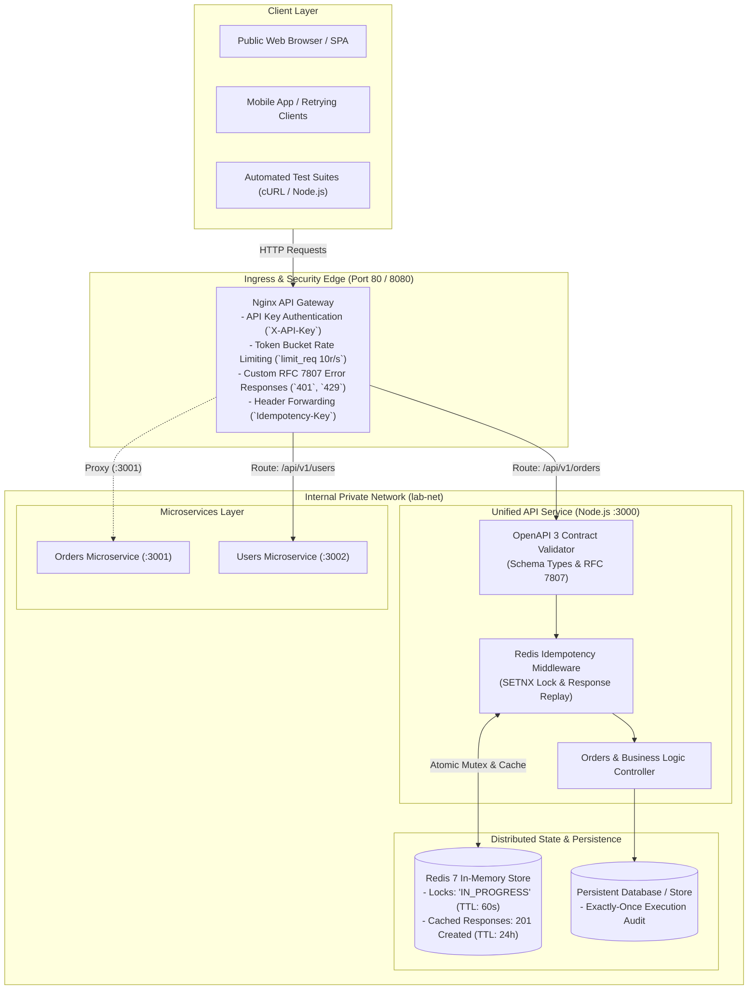

# Module 6: API Design & Networking Essentials

Welcome to the **Module 6: API Design & Networking Essentials** track in the Poridhi cloud environment. This module provides deep theoretical insights and hands-on production engineering labs covering modern RESTful architecture, contract-first design with OpenAPI 3, cursor pagination, idempotent mutations under client retries, Nginx API gateway routing, token bucket rate limiting, and end-to-end integration.

---

## Class Topics & Theory

- **Networking Essentials:** TCP vs UDP mechanics, three-way handshake, Head-of-Line blocking; HTTP/1.1 persistent connections, HTTP/2 binary framing and stream multiplexing, HTTP/3 QUIC over UDP; TLS 1.3 handshake and cryptographic forward secrecy.
- **API Architectural Trade-offs:** REST (hypermedia, resource orientation, caching) vs RPC/gRPC (Protocol Buffers, low latency, streaming, binary serialization) vs GraphQL (client-specified queries, schema stitching, resolving over/under-fetching).
- **Resource Modeling & Evolution:** URI path versioning (`/v1`), backward compatibility rules (additive non-breaking changes), cursor vs offset pagination trade-offs, and RFC 7807 Problem Details error contracts.
- **Idempotency & Data Safety:** Two Generals Problem, at-least-once delivery semantics, atomic distributed mutex locks with Redis `SET NX EX`, and deterministic response caching under network retries.
- **Authentication & Authorization:** Token-based auth, stateless JWTs, stateful sessions, API Key headers, OAuth 2.0 authorization code grant flow, and PKCE.
- **API Gateways & Request Lifecycle:** Reverse proxy routing, SSL termination, edge authentication, token bucket rate limiting (`limit_req`), header forwarding, and private bridge networking.

---

## Architecture Overview

---

## Hands-On Labs

| Lab | Name | Objectives & Core Stack | Deliverables & Test Proof |
| :--- | :--- | :--- | :--- |
| **M6-L1** | [**Contract-First API**](Lab%2001:%20Contract-First%20API%20with%20OpenAPI%203/readme.md) | - Design an OpenAPI 3.0.3 contract. - Configure cursor pagination and `Idempotency-Key` headers. - Implement RFC 7807 error responses. - Generate Node.js Express server stubs. | - Validated `openapi.yaml` - Running Express server stub - Passing test suite for schema, pagination & 400 errors. |
| **M6-L2** | [**Idempotent Write Endpoint**](Lab%2002:%20Idempotent%20Write%20Endpoint%20with%20Node.js%20and%20Redis/readme.md) | - Protect POST endpoints from duplicate retries. - Atomic distributed locks with Redis `SET NX EX`. - Replay cached 201 responses with `X-Cache: HIT`. - Concurrency conflict resolution (`409 Conflict`). | - Redis-backed Express middleware - Docker Compose Redis stack - Passing automated test proving duplicate requests produce one effect. |
| **M6-L3** | [**Gateway & Rate-Aware Routing**](Lab%2003:%20Gateway%20&%20Rate-Aware%20Routing%20with%20Nginx/readme.md) | - Front microservices with Nginx API Gateway. - Enforce edge API Key authentication. - Apply token bucket rate-limiting quotas (`5r/s`). - Dynamic route splitting to Orders (:3001) & Users (:3002). | - Declarative `nginx.conf` - Multi-service Docker Compose cluster - Verification script proving 401, 200 routing, and 429 quota. |
| **M6-L4** | [**Integration: API Layer**](Lab%2004:%20Complete%20API%20Layer%20Integration/readme.md) | - Combine OpenAPI spec, Redis idempotency, and Nginx gateway. - Forward custom `Idempotency-Key` across gateway. - End-to-end integration testing through gateway edge. - Architectural reflection on auth and idempotency boundaries. | - Complete Docker Compose stack - Automated end-to-end integration test - 4-line reflection on gateway vs service responsibilities. |

---

## Lab Prerequisites & Tools

The labs in this module utilize standard tools pre-installed in the Poridhi environment:
- **Node.js 18+** (`express`, `ioredis`, `yaml`, `uuid`)
- **Docker & Docker Compose** (for multi-container orchestration)
- **Redis 7** (in-memory key store and distributed locking)
- **Nginx** (reverse proxy, rate limiter, and API gateway)
- **cURL & jq** (HTTP client inspection and JSON formatting)
